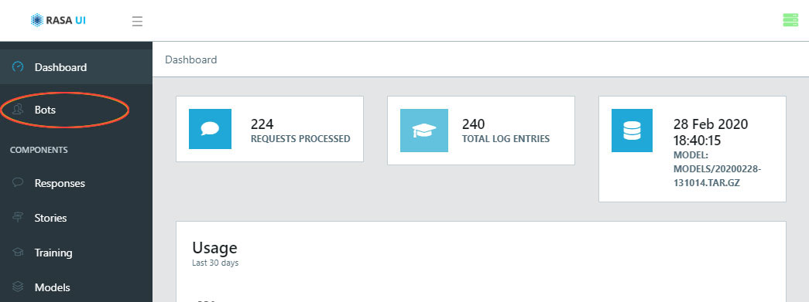

# Set up [RASA](https://rasa.com/) chatbot using [Rasa UI](https://github.com/paschmann/rasa-ui) and [webchat](https://github.com/botfront/rasa-webchat)

**Youtube playlist** \
[https://www.youtube.com/playlist?list=PL75e0qA87dlHQny7z43NduZHPo6qd-cRc](https://www.youtube.com/playlist?list=PL75e0qA87dlHQny7z43NduZHPo6qd-cRc)

**github link for RASA Master Class Demo** \
[https://github.com/RasaHQ/rasa-masterclass](https://github.com/RasaHQ/rasa-masterclass)

**Installation of RASA** \
[https://rasa.com/docs/rasa/user-guide/installation/](https://rasa.com/docs/rasa/user-guide/installation/)  
please refer above URL for Installation of RASA, Python and other dependency

# Setup Using Docker-Compose
[https://rasa.com/docs/rasa/user-guide/running-rasa-with-docker/](https://rasa.com/docs/rasa/user-guide/running-rasa-with-docker/) \
Install Docker and keep directory structure as below for docker compose.

```language
├── app
├── html
│   └── index.html
├── rasa-ui
│   └── server
│         └── data
│               └── .gitignore
│               └──  models
│                      └── .gitignore
├── docker-compose.yml
```

now run below command to up docker containers

```bash
docker-compose up -d
```

then connect to rasa container using below command 

```bash
docker exec -it  <rasa container id> bash
```

If you are upping docker container first time then there will not any file in **‘/app/’** folder for training data, to create training data files you have to initialise new project, if already initialised then only training data file will create in **‘/app/’** folder

```bash
rasa init --no-prompt
```

:warning: **Note - above command will overwrite all training data file with existing files if there any**

below files will create in **/app/** folder and will Training an initial model

<table>
    <tr>
        <td>
            __init__.py
        </td>
        <td>
            an empty file that helps python find your actions
        </td>
    </tr>
    <tr>
        <td>
            actions.py
        </td>
        <td>
            code for your custom actions
        </td>
    </tr>
    <tr>
        <td>config.yml ‘*’
        </td>
        <td>configuration of your NLU and Core models
        </td>
    </tr>
    <tr>
        <td>credentials.yml
        </td>
        <td>details for connecting to other services
        </td>
    </tr>
    <tr>
        <td>data/nlu.md ‘*’
        </td>
        <td>your NLU training data
        </td>
    </tr>
    <tr>
        <td>data/stories.md ‘*’
        </td>
        <td>your stories
        </td>
    </tr>
    <tr>
        <td>domain.yml ‘*’
        </td>
        <td>your assistant’s domain
        </td>
    </tr>
    <tr>
        <td>endpoints.yml
        </td>
        <td>details for connecting to channels like fb messenger
        </td>
    </tr>
    <tr>
        <td>models/&lt;timestamp&gt;.tar.gz
        </td>
        <td>your initial model
        </td>
    </tr>
</table>
<br>
To set newly trained model, you need to down docker-compose using below command

```bash
docker-compose down
```


<br>

# Rasa Webchat
Use [Rasa webchat](https://github.com/botfront/rasa-webchat) widget to connect with a chatbot 💬 platform. \
Create index.html in **/html/** folder and paste below code on body tag.

```html
<div id="webchat"/>
<script src="https://storage.googleapis.com/mrbot-cdn/webchat-latest.js"></script>
// Or you can replace latest with a specific version
<script>
  WebChat.default.init({
    selector: "#webchat",
    initPayload: "/get_started",
    customData: {"language": "en"},
    socketUrl: "http://localhost:5500",
    socketPath: "/socket.io/",
    title: "Title",
    subtitle: "Subtitle",
  })
</script>
```

To set backend connection between Rasa Webchat and Rasa server, below code in **/app/credentials.yml** file.

```yml
socketio:
  user_message_evt: user_uttered
  bot_message_evt: bot_uttered
  session_persistence: true
```

Now again up docker-compose using below command

```bash
docker-compose up -d
```

Now you can test your newly created chatbot on [http://localhost:8100/](http://localhost:8100/) url
<br><br><br>

# Train NLU model using RASA server

You can train your NLU model by editing training data file from **/app/ folder** 
<br><br>
After updates in  stories and NLU data, connect to rasa server and run command to train model.

```bash
docker exec -it  <rasa container id> bash
rasa train
```

This command will the trained model and save trained model into the **/app/models/** directory.
<br><br>
Whenever you train a model, you have to down the docker containers and again have to up the docker containers using the below command to make active newly trained model in production.

```bash
docker-compose down
```

then

```bash
docker-compose up -d
```

<br><br>

# Train NLU model using [Rasa UI](https://github.com/paschmann/rasa-ui) server

You can train NLU model using Rasa UI web application. for more detail about Rasa UI check below link \
[https://github.com/paschmann/rasa-ui](https://github.com/paschmann/rasa-ui)

You can connect Rasa UI web application on [http://localhost:5001](http://localhost:5001) \
As per Rasa UI username is "admin" and password is "admin". but you can change these details by editing the environment variable in docker-compose.yml file. 
Now as per docker-compose.yml file login details are below \
**username - admin** \
**password - 321**

below command are useful to connect and check logs of docker container 

```language
docker exec -it <rasa_ui container id> sh
docker logs --follow <rasa container id>
```


Below are steps to train NLU Model.

### Create a New Bot and Intents  
Connect Rasa UI web application on [http://localhost:5001](http://localhost:5001).

Select "Bots" tab from left side panel,

<br>


Click on the (+) button from right top to add a new bot.

<br>


1. Give a name for bot \
2. In **"Server Output Folder"** filed add path **/app/models/**.
3. In **"Config"** field add pipeline and policies. keep below code

```yml
# Configuration for Rasa NLU.
# https://rasa.com/docs/rasa/nlu/components/
language: "en"

pipeline: "pretrained_embeddings_spacy"

# Configuration for Rasa Core.
# https://rasa.com/docs/rasa/core/policies/
policies:
  - name: KerasPolicy
    epochs: 100
    max_history: 1
  - name: FallbackPolicy
    fallback_action_name: 'action_default_fallback'
  - name: MemoizationPolicy
    max_history: 1
  - name: FormPolicy
  - name: MappingPolicy
```
For more information about Pipeline and Policies check below links \
[https://rasa.com/docs/rasa/nlu/choosing-a-pipeline/](https://rasa.com/docs/rasa/nlu/choosing-a-pipeline/) \
[https://rasa.com/docs/rasa/core/policies/](https://rasa.com/docs/rasa/core/policies/)


<br><br>

 
 Now select newly created Bot

<br><br>


Click on the (+) button to create Intents

<br><br><br>


Give name for Intent. I have given "greet". Then Save it.

<br><br><br>


Now Select the newly created Intent "greet".

<br><br><br>


Enter an expression and press enter. I have entered below expressions for **"greet"** intent.
- hey
- hello
- hi
- good morning
- good evening
- hey there

Use the below data and create more Intent following the above steps. 

*intent -* **goodbye**
- bye
- goodbye
- see you around
- see you later

*intent -* **affirm**
- yes
- indeed
- of course
- that sounds good
- correct

*intent -* **deny**
- no
- never
- I don't think so
- don't like that
- no way
- not really

*intent -* **mood_great**
- perfect
- very good
- great
- amazing
- wonderful
- I am feeling very good
- I am great
- I'm good

*intent -* **mood_unhappy**
- sad
- very sad
- unhappy
- bad
- very bad
- awful
- terrible
- not very good
- extremely sad
- so sad

<br><br><br>

### Create responses/replies using Actions for intents/user inputs
we will create below responses for intents
```language
  utter_greet:
  - text: "Hey! How are you?"

  utter_cheer_up:
  - text: "Here is something to cheer you up:"

  utter_did_that_help:
  - text: "Did that help you?"

  utter_happy:
  - text: "Great carry on!"

  utter_goodbye:
  - text: "Bye"
```


1. to create response for intent click on  **"Response"** from left side
2. Select **"rasa"** bot from dropdown

<br>


click on the plus (+) button to add response

<br>


1. In the name field add the response name "greet". Always **"utter_"** before response/action name. So response/action name will be **"utter_greet"**.
2. Click on the save button

<br>


Now click on the (+) button to add response text

<br>


1.  Select "text" from dropdown.
2. Enter the response text. I have added "Hey! How are you?"
3. Click  button to save.
4. you can add more response text for one action.

Add below responses using the above step.
```language
  utter_cheer_up:
  - text: "Here is something to cheer you up:"

  utter_did_that_help:
  - text: "Did that help you?"

  utter_happy:
  - text: "Great carry on!"

  utter_goodbye:
  - text: "Bye"
```

<br><br><br>

### Write Stories using intents and responses
Here, you will teach your chatbot how to respond to your messages. Core models learn from real conversational data in the form of training “stories”. A story is a real conversation between a user and chatbot. Lines with intents and entities reflect the user’s input and action names show what the chatbot should do in response.

Below is an example of a simple conversation. The user says hello, and the chatbot says "Hey! How are you?". This is how it looks as a story:

**story1**
```language
## happy path
* greet
  - utter_greet
* mood_great
  - utter_happy
```

Below are steps to add story in RASA UI

1. Select the Story tab from the left side.
2. Select "rasa" bot from dropdown.

<br>


Click on plus (+) button to add story

<br>


Click on the arrow button to write the story.

<br>


1. Type "greet" in search box
2. from the dropdown click on "greet" intent. When you click on it, the "greet" intent will add in the story.
3. Then click on "utter_greet" action from the dropdown. 

Using the above steps add "mood_great" intent and "utter_happy" action. Now the story will look like below.
```language
## happy path
* greet
  - utter_greet
* mood_great
  - utter_happy
```
4. This is one story. Click on the save button to save this story.

Now add below stories using above steps
```language
## sad path 1
* greet
  - utter_greet
* mood_unhappy
  - utter_cheer_up
  - utter_did_that_help
* affirm
  - utter_happy

## sad path 2
* greet
  - utter_greet
* mood_unhappy
  - utter_cheer_up
  - utter_did_that_help
* deny
  - utter_goodbye

## say goodbye
* goodbye
  - utter_goodbye
```

<br><br><br>

### Train a Model
After any update in NLU or Core data, or update the domain or configuration, we need to train a model. Below are steps to Train a Model.


1. Select the "Training" tab from the left side.
2. Select "rasa" bot from dropdown.
3. add a comment. I have added "first training of model".
4. Click on the "Start Training" button.

Below message will display on the top side while training a model. It may take a few minutes to train a model depending on system configuration.


After completed training below message will display


<br><br><br>

### Update/Activate a Model
Below are the steps to update/activate a model.

1. Select the "Models" tab from the left side.
2. Select "rasa" bot from dropdown.
3. You can see your trained model in the Model table and comment in the comment column.
4. Click on  button to update/active model.

 It may take a few minutes to update/activate a model depending on system configuration. while the updating model loading message will display on the top side.
 
 
 After the updated/activated model below message will display.
 

 Now you can test your newly activated model in chatbot on [http://localhost:8100/](http://localhost:8100/) url